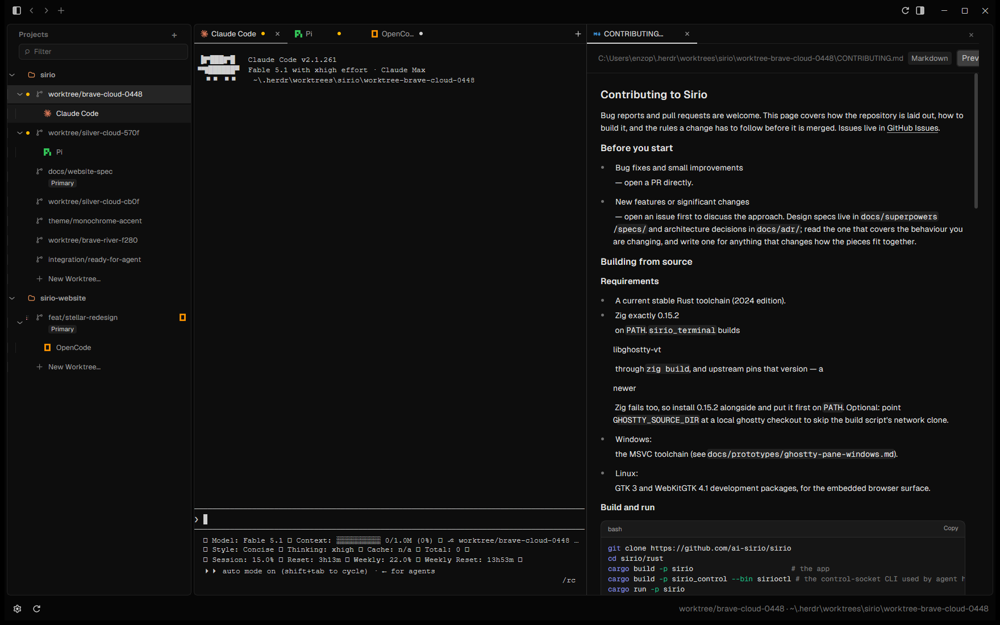
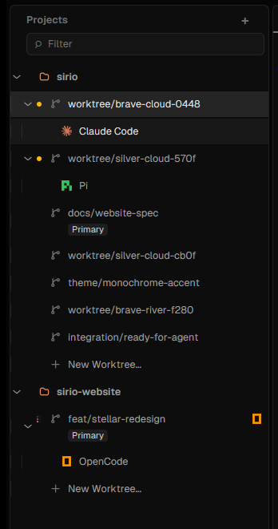
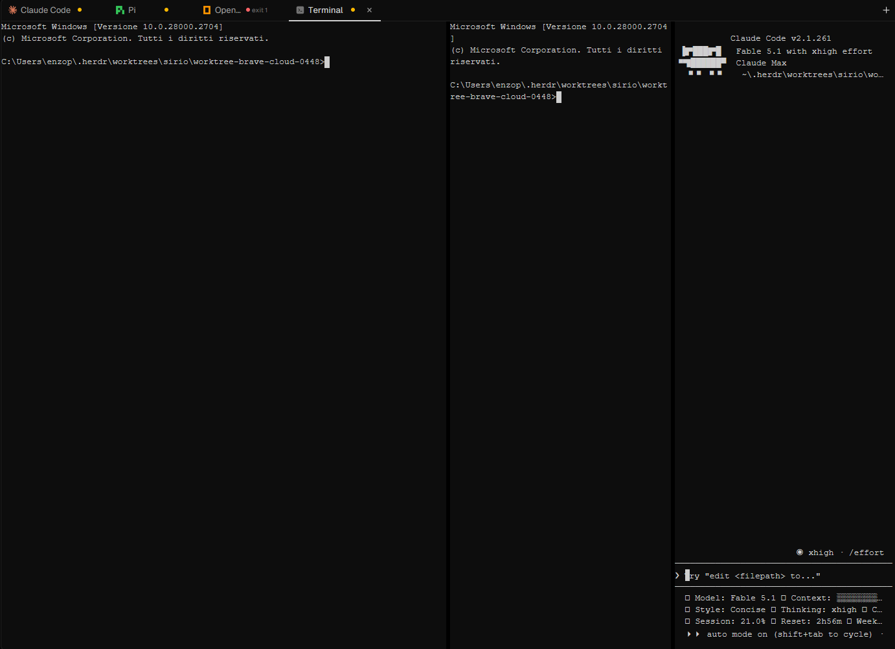
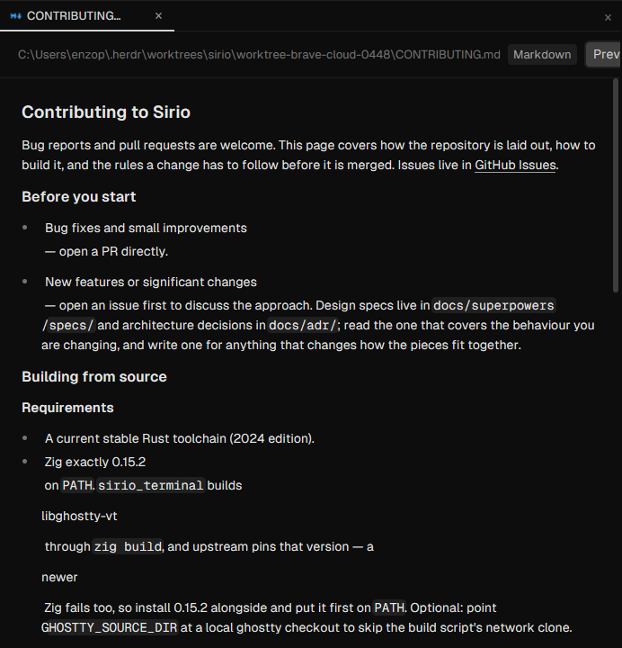
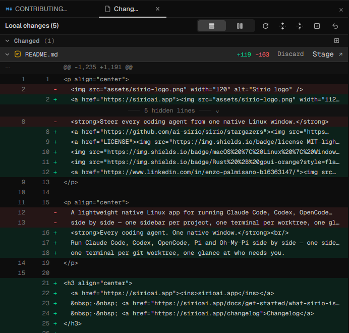

<p align="center">
  <a href="https://sirioai.app"></a>
</p>

<h1 align="center">Sirio</h1>

<p align="center">
  <a href="https://github.com/ai-sirio/sirio/stargazers"></a>
  <a href="LICENSE"></a>
  
  
  <a href="https://www.linkedin.com/in/enzo-palmisano-b16363147/"></a>
</p>

<p align="center">
  <strong>Every coding agent. One native window.</strong><br/>
  Run Claude Code, Codex, OpenCode, Pi and Oh-My-Pi side by side — one sidebar per project,<br/>
  one terminal per git worktree, one glance at who needs you.
</p>

<h3 align="center">
  <a href="https://sirioai.app"><ins>sirioai.app</ins></a>
  &nbsp;·&nbsp; <a href="https://sirioai.app/docs/get-started/what-sirio-is">Docs</a>
  &nbsp;·&nbsp; <a href="https://sirioai.app/changelog">Changelog</a>
</h3>

<p align="center">
  
</p>

## Features

<table>
<tr>
<td width="50%" valign="middle">

### One sidebar, every worktree

Each project lists its git worktrees, one row per branch, sorted by who needs you. Agents appear under the worktree they run in with a live status dot — running, idle, waiting for input — and selecting a row switches the centre column while the terminals underneath keep running.

[Docs →](https://sirioai.app/docs/agents/activity-states)

</td>
<td width="50%">
  <a href="https://sirioai.app/docs/agents/activity-states"></a>
</td>
</tr>
<tr>
<td width="50%" valign="middle">

### A real terminal, split any way

Terminal panes on [libghostty-vt](https://github.com/ghostty-org/ghostty), the VT core behind Ghostty, with tabs and recursive splits per worktree. Closing the window flushes state and nothing else: agent PTYs live on until you quit.

[Docs →](https://sirioai.app/docs/workspace/tabs)

</td>
<td width="50%">
  <a href="https://sirioai.app/docs/workspace/tabs"></a>
</td>
</tr>
<tr>
<td width="50%" valign="middle">

### Markdown that keeps up with your agents

Click a `.md` link in the terminal, drag a file in, or press `Ctrl+O`: it opens in a tab as a rendered preview or in code mode, and reloads live while an agent is still writing to it.

[Docs →](https://sirioai.app/docs/workspace/surfaces)

</td>
<td width="50%">
  <a href="https://sirioai.app/docs/workspace/surfaces"></a>
</td>
</tr>
<tr>
<td width="50%" valign="middle">

### Review what the agent changed

A git-status-aware Changes surface for every worktree: stage, unstage, discard, and open a path-specific diff tab — without leaving the window or the agent's terminal.

[Docs →](https://sirioai.app/docs/workspace/surfaces)

</td>
<td width="50%">
  <a href="https://sirioai.app/docs/workspace/surfaces"></a>
</td>
</tr>
<tr>
<td width="50%" valign="middle">

### Agents drive Sirio too

`sirioctl` talks to Sirio over its control socket: create a pane, write a prompt, wait for the agent to finish, read what it printed. It is also how agent lifecycle hooks report status back — and the [`skills/sirio`](skills/sirio/SKILL.md) skill provisioned in every launched worktree teaches agents to use it.

[Docs →](https://sirioai.app/docs/sirioctl/overview)

</td>
<td width="50%">

```bash
WORKER=$(sirioctl panel create --cmd 'claude')
sirioctl panel write --id "$WORKER" \
  --input 'Implement the parser change' --enter
sirioctl panel wait --id "$WORKER"
sirioctl panel read --id "$WORKER"
sirioctl panel close --id "$WORKER"
```

</td>
</tr>
</table>

**Also in the box:**

- **[Embedded browser](https://sirioai.app/docs/workspace/surfaces)** — a native web view beside the terminal, for previewing a dev server without leaving the window.
- **[Tray roster](https://sirioai.app/docs/workspace/tray)** — a tray icon that reflects the worst status across every active agent; click to land in the right worktree, even with the window closed.
- **Desktop notifications** — a heads-up when an agent finishes or stalls.
- **Sessions that survive restarts** — SQLite-backed: reopen Sirio and your projects, worktrees and tabs are back.
- **Usage at a glance** — Claude, Codex, OpenCode and Ollama usage in the status bar.
- **[Signed updates](https://sirioai.app/docs/settings/updates)** — Ed25519-signed release manifests, verified before anything touches the install.

**Deliberately not doing:** remote SSH, mobile relay, scheduling. Sirio is a terminal and agent hub, not an IDE.

---

## Supported Agents

Five adapters, each aware of its CLI's lifecycle — startup banners, resume flags, exit signals, title conventions.

<p>
  <a href="https://docs.anthropic.com/claude/docs/claude-code"><kbd> Claude Code</kbd></a>&nbsp;
  <a href="https://github.com/openai/codex"><kbd> Codex</kbd></a>&nbsp;
  <a href="https://opencode.ai/docs/cli/"><kbd> OpenCode</kbd></a>&nbsp;
  <a href="https://pi.dev"><kbd> Pi</kbd></a>&nbsp;
  <a href="https://omp.sh"><kbd> Oh-My-Pi</kbd></a>
</p>

[How adapters work →](https://sirioai.app/docs/agents/adapters)

---

## Install

Sirio is pre-release. Every tagged release publishes a macOS `.dmg`, a Linux AppImage and a Windows installer to [GitHub Releases](https://github.com/ai-sirio/sirio/releases) — macOS first, Linux and Windows behind it. Until the first tag lands, build from source:

```bash
git clone https://github.com/ai-sirio/sirio
cd sirio/rust
cargo run -p sirio --release
```

You need a stable Rust toolchain and **Zig exactly 0.15.2** (libghostty-vt pins it — a newer Zig fails too), plus the MSVC toolchain on Windows or GTK 3 + WebKitGTK 4.1 headers on Linux. Full details in [CONTRIBUTING.md](CONTRIBUTING.md) and the [build guide](https://sirioai.app/docs/contributing/build-from-source).

Sirio asks for no elevated access and sends no telemetry. The only network calls it makes on its own are the signed update check on release builds, which you can switch off in Settings.

---

## Keyboard Shortcuts

| Action | Shortcut |
|--------|----------|
| New terminal tab | `Ctrl+T` |
| Close active tab | `Ctrl+W` |
| Open file | `Ctrl+O` |
| Save file | `Ctrl+S` |
| Toggle sidebar | `Ctrl+Shift+S` |
| Toggle right panel | `Ctrl+Shift+I` |
| New browser tab | `Ctrl+Shift+L` |
| Focus browser address bar | `Ctrl+L` |
| Restore previous launch | `Ctrl+Shift+O` |
| Settings | `Ctrl+,` |

On Windows three chords move one family over, because the originals are system-wide hotkeys there: toggle sidebar is `Ctrl+Shift+D`, toggle right panel `Ctrl+Shift+R`, restore previous launch `Ctrl+Shift+H`. The command palette always shows the chord that works on your platform.

---

## Community & Support

- **Bugs and ideas:** open an [issue](https://github.com/ai-sirio/sirio/issues) — small fixes can go straight to a PR, bigger changes start as an issue.
- **What's new:** the [changelog](https://sirioai.app/changelog) on sirioai.app.
- **Author:** [Enzo Palmisano](https://www.linkedin.com/in/enzo-palmisano-b16363147/).
- **Show support:** [star the repo](https://github.com/ai-sirio/sirio) to follow along.

---

## Developing

Want to contribute or run locally? [CONTRIBUTING.md](CONTRIBUTING.md) covers the toolchain, the 17-crate workspace layout, the verification gate and the rules a change has to follow. The architecture notes an agent needs live in [`CLAUDE.md`](CLAUDE.md).

---

## Acknowledgements

Sirio began as a fork of [Orca](https://github.com/stablyai/orca), in its original Swift/macOS form and with a deliberately reduced scope, and was then rewritten in Rust on [gpui](https://github.com/zed-industries/zed). The UI is built from [bezel](https://github.com/crabtalk/bezel); the terminal runs on [libghostty-vt](https://github.com/ghostty-org/ghostty) with [portable-pty](https://github.com/wez/wezterm). Designed and built with [Claude Code](https://claude.ai/code) and [OpenCode](https://opencode.ai/) as pair programmers.

## License

Sirio is free and open source under the [MIT License](LICENSE).
